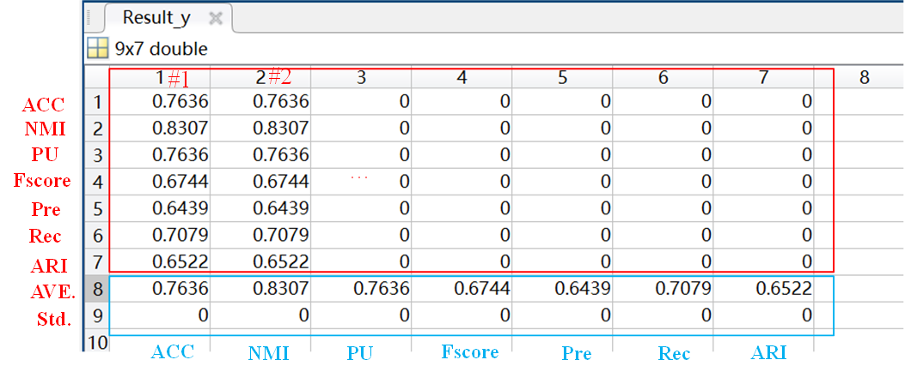
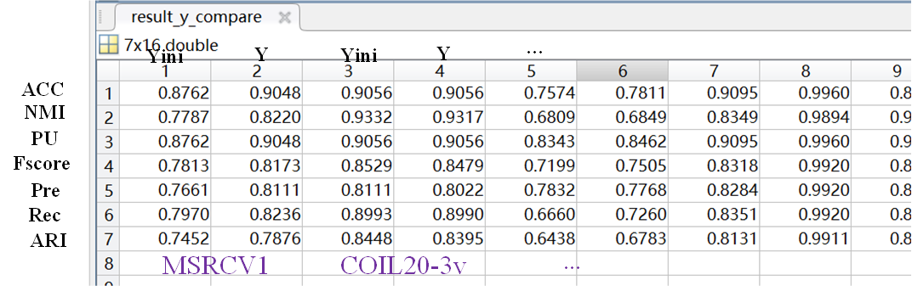
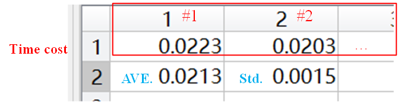

# [Neuro 2025] HISSM model for multiview clustering
## Contributions
This is the official Matlab implementation of  paper "Fast Multi-view Graph-based Clustering via Hierarchical Initialization and Supercluster Similarity Minimization". The proposed HISSM model includes two steps named as Hierarchical Initialization(HI) and Supercluster Similarity Minimization(SSM), where HI is an initialization method and SSM multi-view clustering model for discrete cluster indicators, respectively.  Our work enables  to perform second-level calculations on a nxn graph with a sample size of 10,000 in just a few seconds.

## For more works
My studies focus on machine learning (deep learning) and its applications to image enhancement, data clustering (classification), object recognition (tracking) etc.  If you are interested at my works, you can get more papers and codes at my [Github](https://github.com/NianWang-HJJGCDX/) and [Homepage](https://nianwang-hjjgcdx.github.io/).

# Usage
## Main body 
* funs: include some used functions.
* fun/Y_Initialize: different initial methods.
* Results_y_ini: record the results of initial label of proposed HI method.
* Results_y: record the results of refined label of proposed SSM method.
* Results_y_compare: record the results after HI and SSM on all testing datasets.
* Dataset: include some testing datasets.
## For quantitative comparison
First, set runtimes and test datasets in Run_HISSM.m 
```
runtimes = 1; % running times on each dataset, default: 1
dataname = {'MSRCV1','COIL20-3v','3Sources','HW2sources','ORL','BBC','BRCA','Hdigit','yaleA'};
```
Then, run  Run_HISSM.m. ALL the results in the paper are obtained simultaneously and recorded as the following forms.
## For result record

* For y_ini and y, we record the results of each dataset separately. The results include  accuracy (ACC),Normalized Mutual Information(NMI),Purity(Pu)
,Fscore,Precision(Pre),Recall(Rec)，Adjusted Rand Index (ARI)，average value (AVE.) of different running  and Standard deviation (Std.) of different running. Suppose the runtimes = 2 is set, the  data record is shown in the figure.
  
  
* For better comparing y_ini and y, we also record the results of all dataset together.  The data record is shown in the figure.
    
* For time cost, we record the results of each dataset separately. The  data record is shown in the figure.
    


## Acknowledge
This work  partly relies on the following paper. We sincerely think their outstanding contributions.

[1] Sarfraz S, Sharma V, Stiefelhagen R. Efficient parameter-free clustering using first neighbor relations[C]//Proceedings of the IEEE/CVF conference on computer vision and pattern recognition. 2019: 8934-8943.

[2] Nie F, Lu J, Wu D, et al. A novel normalized-cut solver with nearest neighbor hierarchical initialization[J]. IEEE Transactions on Pattern Analysis and Machine Intelligence, 2023, 46(1): 659-666.
## Citation
If you use our code, please kindly cite our paper by

```
@Article{HISSM,
AUTHOR = {Wang, Nian and Cui, Zhigao and Lan, Yunwei and Zhang, Cong and Xue, Yuanliang and Su, Yanzhao and Li, Aihua},
TITLE = {Discrete Multi-view Graph-based Clustering via Hierarchical Initialization and Supercluster Similarity Minimization},
JOURNAL = {Neurocomputing},
YEAR = {2025},
}
