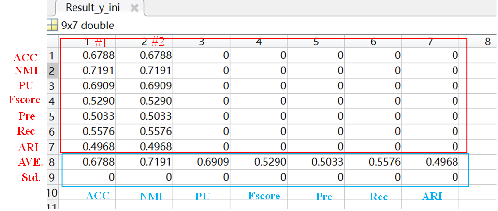

## HISSM model for multiview clustering
This is a Matlab implementation of our paper "Fast Multi-view Graph-based Clustering via Hierarchical Initialization and Supercluster Similarity Minimization". Code will be updated after paper is published. The proposed HISSM model includes two steps named as Hierarchical Initialization(HI) and Supercluster Similarity Minimization(SSM).
## Usage
# Main body 
The main body of code see figure
  
* Y_Initialize: different initial methods.
* Results_y_ini: record the results of initial label of proposed HI method.
* Results_y: record the results of refined label of proposed SSM method.
* Results_y_compare: record the results after HI and SSM on all testing datasets.
* funs: include some used functions.
* Dataset: include some testing datasets.
# For quantitative comparison
First set runtimes and test datasets in Run_HISSM.m 
'''
runtimes = 1; % running times on each dataset, default: 1
dataname = {'MSRCV1','COIL20-3v','3Sources','HW2sources','ORL','BBC','BRCA','Hdigit','yaleA'};
'''
Then run  Run_HISSM.m. ALL the results in the paper are obtained simultaneous and recorded as the following forms.
# For result record

* For y_ini and y, we record the results of each dataset separately. The results includes  accuracy (ACC),Normalized Mutual Information(NMI),Purity(Pu)
,Fscore,Precision(Pre),Recall(Rec) and Adjusted Rand Index (ARI). The description of data record is shown in the figure.
  
  

* For better comparing y_ini and y, we all record the results of all dataset together. The description of data record is shown in the figure.
    

* For time cost, we record the results of each dataset separately. The description of data record is shown in the figure.
  
